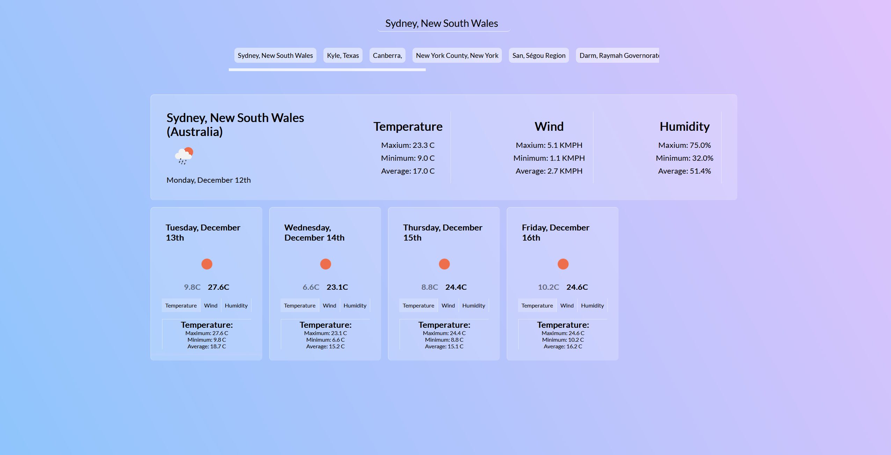

# Weather dashboard app

## Description

This is a simple website that uses the [Open Weather API](https://openweathermap.org/api) to get a five day forecast of a specified city. The app uses [jQuery](https://jquery.com/) HTML and CSS to fetch and display the results.  
When searching a city, the application calls the [Geocoding API](https://openweathermap.org/api/geocoding-api) and displays cities matching the name provided that can then be clicked on to display the weather forecast. Previously searched cities are saved. The deployed application can be found [here](https://lorduswhale.github.io/weather-app/)

### Screenshot of application:

